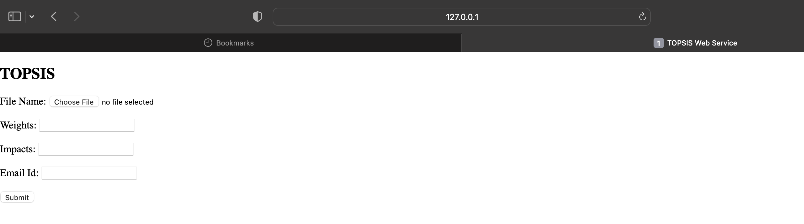
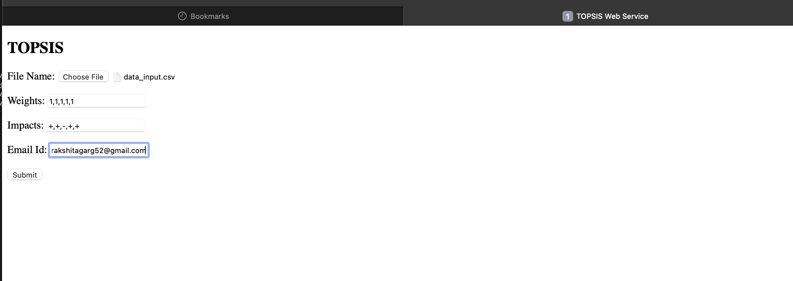
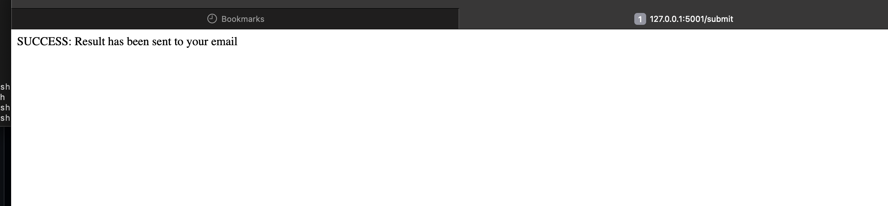

# Part III – Web service for TOPSIS

## Web Service Access

This TOPSIS web service is designed to run **locally**.

The application can be started using:
```bash
python app.py
```
## Screenshots

### Web Service Home Page


### Filled Input Form


### Successful Execution


### Result Email Received


